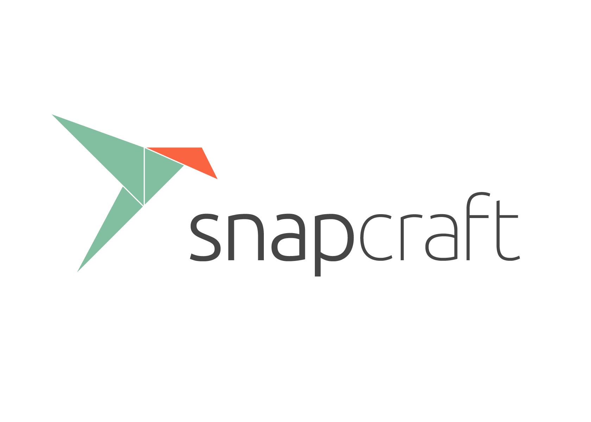

<script src="https://kit.fontawesome.com/267ca0a163.js" crossorigin="anonymous"></script>
<script src="https://cdn.jsdelivr.net/npm/clipboard@2.0.10/dist/clipboard.min.js"></script>

# MetaIoT 

[comment]: <> (This is the header image)

{ align=center width="200" height="300"}


For Organization Information [wolfberryllc.com](https://www.wolfberryllc.com).
<br>
<br>
<br>
<br>

##Coding Languages Used
<i class="fa-brands fa-js fa-4x"></i>
<i class="fa-brands fa-python fa-4x"></i>
<br>
<br>

##Download Apps on Mobile and Desktop
Please check and confirm you have the proper system requirements for your desktop

[comment]: <> (requirements)

| Apps        | Mobile      | Desktop     |             |
| ----------- | ----------- | ----------- | ----------- |
| App Store   |             | Header      | Title       |
| Google Play | Text        | Header      | Title       |
| Snapcraft   | N/A         | Any Linux Device      | Title       |

This project also uses Raspberry Pi and Arduino's R3 board for sensor hat and soil sensor configurations. Please make sure you also have the proper hardware. To purchase hardware please see 

[comment]: <> (hardware purchasing links)
<a href="http://google.com.au/" rel="purchase hardware">{ width="250" height="100"}</a>
<a href="http://google.com.au/" rel="Sensor Kit">{ width="150" height="100"}</a>

<br>

[comment]: <> (Paragraph)

If you are just looking for a demo of what this can do and for learning please see For purchasing information please  see ::link:: for the sensor    and ::link::. If you are going to be building your own application and using your own sensors please move forward to the developer documentation.

<br>
<br>
##Download the apps
Once you have confirmed you have the correct hardware its time to download the apps!
[comment]: <> (App Store Images & Google Play)
<a href="http://google.com.au/" rel="some text"></a><a href="http://google.com.au/" rel="some text"></a><a href="http://google.com.au/" rel="some text">{ align=center width="250" height="200"}</a>


<br>

[comment]: <> (Snapcraft link)
## Snapcraft 
Any linux device will work but this project was optimized for Raspberry Pi.

### install snap
* `mkdocs new [dir-name]` - Create a new project.
* `mkdocs serve` - Start the live-reloading docs server.
* `mkdocs build` - Build the documentation site.
* `mkdocs -h` - Print help message and exit.


## Mobile App Configurations


## Sensors

    mkdocs.yml    # The configuration file.
    docs/
        index.md  # The documentation homepage.
        ...       # Other markdown pages, images and other files.

### Add Code 
``` py
import tensorflow as tf
```

## Codeblocks with titles
``` py title="bubble_sort.py"
def bubble_sort(items):
    for i in range(len(items)):
        for j in range(len(items) - 1 - i):
            if items[j] > items[j + 1]:
                items[j], items[j + 1] = items[j + 1], items[j]
                
```

<div class="grid cards" markdown>

##Coding Languages Used
<i class="fa-brands fa-js fa-4x"></i>
<i class="fa-brands fa-python fa-4x"></i>

</div>

<a href="https://github.com/wolfberryllc/MetaIoT"><i class="fa-brands fa-github fa-4x"></i></a>
</div>

[comment]: <> (This is a comment, it will not be included)
[comment]: <> (in  the output file unless you use it in)
[comment]: <> (add copy to code)

<script src="dist/clipboard.min.js"></script>


