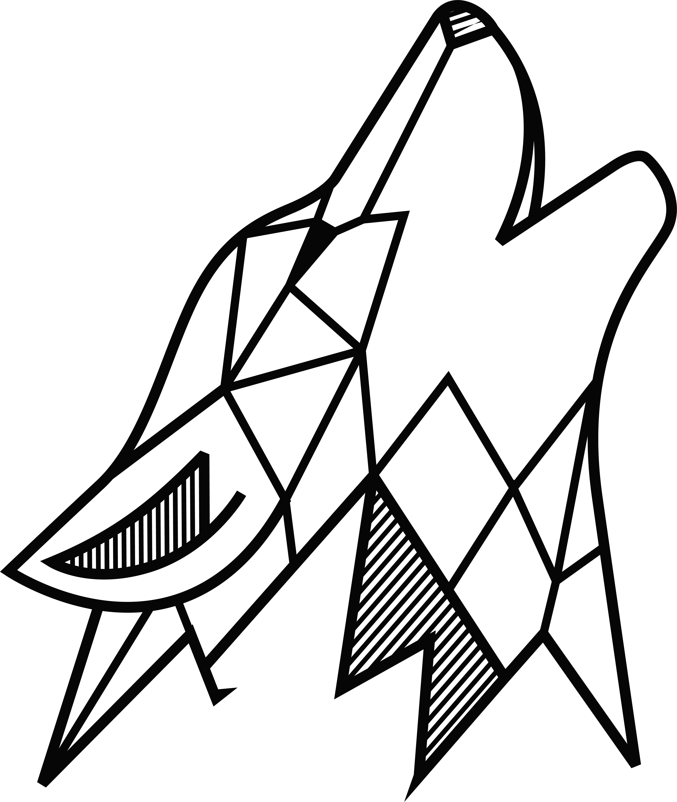

<script src="https://kit.fontawesome.com/267ca0a163.js" crossorigin="anonymous"></script>
<script src="https://cdn.jsdelivr.net/npm/clipboard@2.0.10/dist/clipboard.min.js"></script>

# MetaIoT { align=center width="40" height="50"}
<br>
<br>
[comment]: <> (This is the header image)

{ align=center width="275" height="400"}
<br>
<br>

This is documentation for an open-source project that creates a data route that goes from sensor to storage using the security of blockchain and the visualization provided from AR technologies. For Organization Information see [wolfberryllc.com](https://www.wolfberryllc.com).
<br>

##System Requirements
{ align=center width="350" height="200"}
<br>
Please check and confirm you have the proper system requirements.

[comment]: <> (requirements)

| Apps        | Mobile      | Desktop     |             |
| ----------- | ----------- | ----------- | ----------- |
| App Store   |             | Header      | Title       |
| Google Play | Text        | Header      | Title       |
| Snapcraft   | N/A         | Any Linux Device      | Title       |

This project also uses Raspberry Pi and Arduino's R3 board for sensor hat and soil sensor configurations. Please make sure you also have the proper hardware. To purchase hardware please see 

[comment]: <> (hardware purchasing links)
<a href="http://google.com.au/" rel="purchase hardware">{ width="150" height="50"}</a>
<a href="http://google.com.au/" rel="Sensor Kit">{ width="75" height="50"}</a>
<a href="http://google.com.au/" rel="Sensor Kit">{ width="75" height="50"}</a>

<br>

[comment]: <> (Paragraph)

{==<i class="fa-regular fa-lightbulb fa-1x"></i> this will be for important information If you are just looking for a demo of what this can do and for learning please see For purchasing information please  see for the sensor    and If you are going to be building your own application and using your own sensors please move forward to the developer documentation.==}
#### Download
[comment]: <> (App Store Images & Google Play)
<a href="http://google.com.au/" rel="some text"></a><a href="http://google.com.au/" rel="some text"></a><a href="http://google.com.au/" rel="some text">{ align=center width="200" height="150"}</a>

{==<i class="fa-regular fa-lightbulb fa-1x"></i>This is how you will highlight important to know information. This can be footnotes and commments. Copy the text and replace this with placer information.9iij==}
<br>

[comment]: <> (Snapcraft link)
## Snapcraft 
Any linux device will work but this project was optimized for Raspberry Pi.

#### install snap
* `mkdocs new [dir-name]` - Create a new project.
* `mkdocs serve` - Start the live-reloading docs server.
* `mkdocs build` - Build the documentation site.
* `mkdocs -h` - Print help message and exit.

#### Run Updates 


## Mobile Apps

#### IOS
#### Android


## Sensors

    mkdocs.yml    # The configuration file.
    docs/
        index.md  # The documentation homepage.
        ...       # Other markdown pages, images and other files.
##Coding Languages Used
<i class="fa-brands fa-js fa-4x"></i>
<i class="fa-brands fa-python fa-4x"></i>
<i class="fa-brands fa-html5 fa-4x" ></i>


``` py
import tensorflow as tf
```

## Codeblocks with titles


``` py title="bubble_sort.py"
def bubble_sort(items):
    for i in range(len(items)):
        for j in range(len(items) - 1 - i):
            if items[j] > items[j + 1]:
                items[j], items[j + 1] = items[j + 1], items[j]
                
```

<div class="grid cards" markdown>

</div>


[comment]: <> (This is a comment, it will not be included)


[comment]: <> (code block)
````
document$.subscribe(function() { // (1)
  var tables = document.querySelectorAll(/* (2) */ "article table")
  tables.forEach(function(table) {
    new Tablesort(table)
  })
})
````


[comment]: <> (code block with line numbers)

~~~ python linenums="1"
def bubble_sort(items):
    for i in range(len(items)):
        for j in range(len(items) - 1 - i):
    if items[j] > items[j + 1]:
    items[j], items[j + 1] = items[j + 1], items[j]
~~~


<br>


[comment]: <> (logo to link font awesome)

<a href="https://github.com/wolfberryllc/MetaIoT"><i class="fa-brands fa-github fa-4x"></i></a>
</div>


